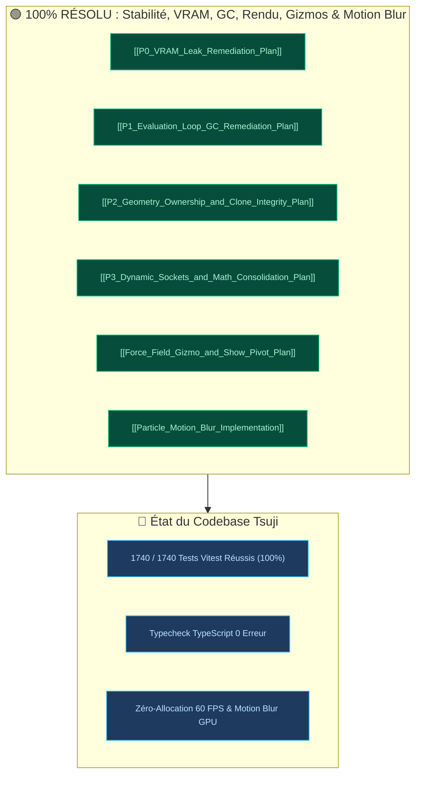

# 🎛️ TABLEAU DE BORD — TSUJI AGENTIC RAG

<div align="center">


<div style="margin-top: 10px; display: flex; gap: 8px; justify-content: center; flex-wrap: wrap;">
  
  
  
  
</div>

<p style="font-size: 13px; color: #94a3b8; margin-top: 8px;"><em>Mémoire Architecturale, Base de Connaissances & Cockpit de Développement</em></p>

</div>

---

## 📊 1. Métriques & Statut en Direct

```dataviewjs
// Requête dynamique pour Obsidian Dataview
const kb = dv.pages('"Knowledge_Base"').length;
const specs = dv.pages('"Project_Specs"').length;
const roadmap = dv.pages('"Future_Roadmap"').length;
const flaws = dv.pages('"Audits_and_Flaws"').length;
const total = kb + specs + roadmap + flaws;

dv.paragraph(`
<div style="display: flex; gap: 10px; justify-content: space-between; flex-wrap: wrap; margin: 12px 0;">
  <div style="background: rgba(30, 41, 59, 0.6); border-radius: 8px; padding: 10px 14px; flex: 1; min-width: 100px; border-left: 4px solid #7c3aed; text-align: left;">
    <div style="font-size: 20px; font-weight: bold; color: #a78bfa;">${total}</div>
    <div style="font-size: 10px; text-transform: uppercase; color: #94a3b8;">Total Notes</div>
  </div>
  <div style="background: rgba(30, 41, 59, 0.6); border-radius: 8px; padding: 10px 14px; flex: 1; min-width: 100px; border-left: 4px solid #38bdf8; text-align: left;">
    <div style="font-size: 20px; font-weight: bold; color: #38bdf8;">${kb}</div>
    <div style="font-size: 10px; text-transform: uppercase; color: #94a3b8;">🧠 Connaissances</div>
  </div>
  <div style="background: rgba(30, 41, 59, 0.6); border-radius: 8px; padding: 10px 14px; flex: 1; min-width: 100px; border-left: 4px solid #22c55e; text-align: left;">
    <div style="font-size: 20px; font-weight: bold; color: #4ade80;">${specs}</div>
    <div style="font-size: 10px; text-transform: uppercase; color: #94a3b8;">🛠️ Spécifications</div>
  </div>
  <div style="background: rgba(30, 41, 59, 0.6); border-radius: 8px; padding: 10px 14px; flex: 1; min-width: 100px; border-left: 4px solid #c084fc; text-align: left;">
    <div style="font-size: 20px; font-weight: bold; color: #c084fc;">${roadmap}</div>
    <div style="font-size: 10px; text-transform: uppercase; color: #94a3b8;">🚀 Roadmap</div>
  </div>
  <div style="background: rgba(30, 41, 59, 0.6); border-radius: 8px; padding: 10px 14px; flex: 1; min-width: 100px; border-left: 4px solid #f87171; text-align: left;">
    <div style="font-size: 20px; font-weight: bold; color: #f87171;">${flaws}</div>
    <div style="font-size: 10px; text-transform: uppercase; color: #94a3b8;">⚠️ Audits</div>
  </div>
</div>
`);
```

> [!NOTE]
> *Volume global du coffre :* **60+ notes atomiques** réparties sur 4 pôles interconnectés.

---

## 🚨 2. Centre d'Alertes & Diagnostic de Santé



> [!SUCCESS]
> **Toutes les Priorités & Dernières Fonctionnalités sont Validées :**  
> • **P0 (VRAM) :** Tous les caches de nœuds équipés de `disposeObject3D` $\rightarrow$ [[P0_VRAM_Leak_Remediation_Plan]].  
> • **P1 (GC 60 FPS) :** `GraphStructuralCache`, indexation $\mathcal{O}(1)$ et Object Pooling $\rightarrow$ [[P1_Evaluation_Loop_GC_Remediation_Plan]].  
> • **P2 (Rendu & Clonage) :** Propagation multi-hop (`sceneRoots.ts`) et clonage de TypedArrays (`cloneGraph.ts`) $\rightarrow$ [[P2_Geometry_Ownership_and_Clone_Integrity_Plan]].  
> • **P3 (Sockets & Maths) :** Purge proactive des fils orphelins et invariants d'angles verrouillés $\rightarrow$ [[P3_Dynamic_Sockets_and_Math_Consolidation_Plan]].  
> • **Gizmos & Pivots :** Gizmo 3D interactif pour Force Fields + Entrée Matrix + Option universelle "Show Pivot" avec croix jaune viewport $\rightarrow$ [[Force_Field_Gizmo_and_Show_Pivot_Plan]].  
> • **Motion Blur Particules & InstancedMesh :** Shaders de vélocité GPU pour `THREE.Points` et `THREE.InstancedMesh` avec empreinte de déplacement élargie et préservation stricte de la visibilité $\rightarrow$ [[Particle_Motion_Blur_Implementation]].

---

## ⚡ 3. Cockpit Développeur & Actions Rapides

<div style="display: grid; grid-template-columns: repeat(auto-fit, minmax(260px, 1fr)); gap: 12px; margin: 16px 0;">

<!-- ACTION 1 -->
<div style="background: rgba(30, 41, 59, 0.7); border-radius: 10px; padding: 14px; border: 1px solid rgba(124, 58, 237, 0.4); display: flex; flex-direction: column; justify-content: space-between;">
  <div>
    <div style="display: flex; align-items: center; justify-content: space-between; margin-bottom: 6px;">
      <span style="font-weight: bold; color: #c4b5fd; font-size: 14px;">➕ Créer un Nœud</span>
      <span style="background: #4c1d95; color: #ddd6fe; font-size: 10px; padding: 2px 6px; border-radius: 4px;">Authoring</span>
    </div>
    <p style="font-size: 12px; color: #94a3b8; margin: 0 0 10px 0;">Gabarit TypeScript pur, typage strict des ports et tests unitaires.</p>
  </div>
  <a href="#Node%20Creation%20Guide" style="text-decoration: none; font-size: 12px; font-weight: bold; color: #a78bfa;">👉 Consulter [[Node Creation Guide]]</a>
</div>

<!-- ACTION 2 -->
<div style="background: rgba(30, 41, 59, 0.7); border-radius: 10px; padding: 14px; border: 1px solid rgba(16, 185, 129, 0.4); display: flex; flex-direction: column; justify-content: space-between;">
  <div>
    <div style="display: flex; align-items: center; justify-content: space-between; margin-bottom: 6px;">
      <span style="font-weight: bold; color: #6ee7b7; font-size: 14px;">🧹 Purger la VRAM</span>
      <span style="background: #064e3b; color: #a7f3d0; font-size: 10px; padding: 2px 6px; border-radius: 4px;">Mémoire GPU</span>
    </div>
    <p style="font-size: 12px; color: #94a3b8; margin: 0 0 10px 0;">Protocole de libération récursive des géométries, textures et shaders.</p>
  </div>
  <a href="#Recursive%20ThreeJS%20Disposal%20Protocol" style="text-decoration: none; font-size: 12px; font-weight: bold; color: #34d399;">👉 Consulter [[Recursive ThreeJS Disposal Protocol]]</a>
</div>

<!-- ACTION 3 -->
<div style="background: rgba(30, 41, 59, 0.7); border-radius: 10px; padding: 14px; border: 1px solid rgba(56, 189, 248, 0.4); display: flex; flex-direction: column; justify-content: space-between;">
  <div>
    <div style="display: flex; align-items: center; justify-content: space-between; margin-bottom: 6px;">
      <span style="font-weight: bold; color: #7dd3fc; font-size: 14px;">🏎️ Réduire Draw Calls</span>
      <span style="background: #0c4a6e; color: #bae6fd; font-size: 10px; padding: 2px 6px; border-radius: 4px;">Rendu 60 FPS</span>
    </div>
    <p style="font-size: 12px; color: #94a3b8; margin: 0 0 10px 0;">Stratégies d'instanciation (`InstancedMesh`) et de lots (`BatchedMesh`).</p>
  </div>
  <a href="#Draw%20Call%20Reduction%20Strategies" style="text-decoration: none; font-size: 12px; font-weight: bold; color: #38bdf8;">👉 Consulter [[Draw Call Reduction Strategies]]</a>
</div>

<!-- ACTION 4 -->
<div style="background: rgba(30, 41, 59, 0.7); border-radius: 10px; padding: 14px; border: 1px solid rgba(245, 158, 11, 0.4); display: flex; flex-direction: column; justify-content: space-between;">
  <div>
    <div style="display: flex; align-items: center; justify-content: space-between; margin-bottom: 6px;">
      <span style="font-weight: bold; color: #fcd34d; font-size: 14px;">📦 Pipeline GLTF & KTX2</span>
      <span style="background: #451a03; color: #fde68a; font-size: 10px; padding: 2px 6px; border-radius: 4px;">Assets 3D</span>
    </div>
    <p style="font-size: 12px; color: #94a3b8; margin: 0 0 10px 0;">Compression automatique Meshopt et Basis Universal via `gltfpack`.</p>
  </div>
  <a href="#GLTF%20Asset%20Ingestion%20Pipeline" style="text-decoration: none; font-size: 12px; font-weight: bold; color: #fbbf24;">👉 Consulter [[GLTF Asset Ingestion Pipeline]]</a>
</div>

<!-- ACTION 5 -->
<div style="background: rgba(30, 41, 59, 0.7); border-radius: 10px; padding: 14px; border: 1px solid rgba(236, 72, 153, 0.4); display: flex; flex-direction: column; justify-content: space-between;">
  <div>
    <div style="display: flex; align-items: center; justify-content: space-between; margin-bottom: 6px;">
      <span style="font-weight: bold; color: #f472b6; font-size: 14px;">🐞 Profiler Mémoire JS</span>
      <span style="background: #500724; color: #fbcfe8; font-size: 10px; padding: 2px 6px; border-radius: 4px;">DevTools</span>
    </div>
    <p style="font-size: 12px; color: #94a3b8; margin: 0 0 10px 0;">Guide d'analyse des snapshots de tas et élimination des pauses GC.</p>
  </div>
  <a href="#Chrome%20DevTools%20Memory%20Profiling%20Playbook" style="text-decoration: none; font-size: 12px; font-weight: bold; color: #ec4899;">👉 Consulter [[Chrome DevTools Memory Profiling Playbook]]</a>
</div>

<!-- ACTION 6 -->
<div style="background: rgba(30, 41, 59, 0.7); border-radius: 10px; padding: 14px; border: 1px solid rgba(168, 85, 247, 0.4); display: flex; flex-direction: column; justify-content: space-between;">
  <div>
    <div style="display: flex; align-items: center; justify-content: space-between; margin-bottom: 6px;">
      <span style="font-weight: bold; color: #d8b4fe; font-size: 14px;">📐 Calibration DLT</span>
      <span style="background: #3b0764; color: #e9d5ff; font-size: 10px; padding: 2px 6px; border-radius: 4px;">Mapping 3D</span>
    </div>
    <p style="font-size: 12px; color: #94a3b8; margin: 0 0 10px 0;">Formulation matricielle et solveur de décentrement de lentille.</p>
  </div>
  <a href="#Direct%20Linear%20Transform%20(DLT)%20Projector%20Calibration" style="text-decoration: none; font-size: 12px; font-weight: bold; color: #c084fc;">👉 Consulter [[Direct Linear Transform (DLT) Projector Calibration]]</a>
</div>

</div>

---

## 🧭 4. Explorateur Interactif des 4 Pôles

<div style="display: grid; grid-template-columns: repeat(auto-fit, minmax(260px, 1fr)); gap: 14px; margin: 16px 0;">

<!-- CARTE 1 -->
<div style="background: rgba(30, 41, 59, 0.5); border: 1px solid #38bdf8; border-radius: 10px; padding: 14px;">
  <h4 style="color: #38bdf8; margin: 0 0 8px 0;">🧠 Base Connaissances</h4>
  <ul style="font-size: 12px; padding-left: 16px; margin: 0; color: #93c5fd; line-height: 1.6;">
    <li>🔥 [[ThreeJS r185 Release and Migration Deep Dive]]</li>
    <li>🔥 [[WebGPU Volumetric Fire Simulation and 3D Fluid Dynamics]]</li>
    <li>💡 [[WebGPU Volumetric Lighting and TRAA Integration]]</li>
    <li>🎮 [[Unreal FPS Camera and Kinematic Capsule Controller]]</li>
    <li>🌟 [[ThreeJS GPU Optimization Synthesis and Production Playbook]]</li>
    <li>🎨 [[Stylized Procedural SDFs and NPR Anime Rendering]]</li>
  </ul>
</div>

<!-- CARTE 2 -->
<div style="background: rgba(30, 41, 59, 0.5); border: 1px solid #22c55e; border-radius: 10px; padding: 14px;">
  <h4 style="color: #4ade80; margin: 0 0 8px 0;">🛠️ Spécifications Tsuji</h4>
  <ul style="font-size: 12px; padding-left: 16px; margin: 0; color: #86efac; line-height: 1.6;">
    <li>🧩 [[Node Catalog]]</li>
    <li>⚡ [[Universal_Nodes_Catalog_3_Chantiers]]</li>
    <li>⚙️ [[Graph Evaluation Runtime]]</li>
    <li>✨ [[Creative FX and Stage Nodes]]</li>
    <li>🎨 [[Socket Type System and Ownership]]</li>
  </ul>
</div>

<!-- CARTE 3 -->
<div style="background: rgba(30, 41, 59, 0.5); border: 1px solid #c084fc; border-radius: 10px; padding: 14px;">
  <h4 style="color: #c084fc; margin: 0 0 8px 0;">🚀 Roadmap & Évolutions</h4>
  <ul style="font-size: 12px; padding-left: 16px; margin: 0; color: #e9d5ff; line-height: 1.6;">
    <li>🏆 [[Strategic_Roadmap_3_Chantiers_Fire_Lighting_FPS]]</li>
    <li>⚡ [[WebGPURenderer Architecture Migration]]</li>
    <li>✨ [[TSL Compute Shaders for Particle Simulation]]</li>
    <li>🧹 [[Centralized ResourceLifecycleManager Design]]</li>
  </ul>
</div>

<!-- CARTE 4 -->
<div style="background: rgba(30, 41, 59, 0.5); border: 1px solid #f87171; border-radius: 10px; padding: 14px;">
  <h4 style="color: #f87171; margin: 0 0 8px 0;">⚠️ Audits & Failles</h4>
  <ul style="font-size: 12px; padding-left: 16px; margin: 0; color: #fca5a5; line-height: 1.6;">
    <li>📋 [[Audit Overview and Executive Summary]]</li>
    <li>🔴 [[FLAW-01a_Unmanaged Camera Group Cache in camera.ts]]</li>
    <li>🟠 [[FLAW-02a_Per-Frame Map and Set Allocation in evaluate.ts]]</li>
    <li>🟡 [[FLAW-03a_One-Hop Ownership Breakage in List Spawners]]</li>
  </ul>
</div>

</div>

---

<div align="center" style="margin-top: 20px;">
  <sub>Tsuji Agentic Knowledge Vault • Architecture 3D & Mémoire RAG • 2026</sub>
</div>
